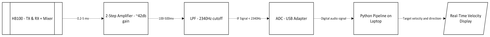

# Doppl-E
A two-antenna CW Doppler radar system capable of velocity measurement and direction finding
## Overview
My name is Jubal Clapp, and I am going into my 3rd year of Electrical Engineering at Queen's University. As I took my 2nd year Electromagnetics course, ELEC 280, RF systems began to fascinate me. After discovering I couldn't take a course in RF systems until 4th year, I was inspired to start an RF summer project.

After I finished my initial scouting into different RF systems, I landed on radar. The intersection between DSP, Electromagnetics, and Electronics fascinated me. Further research led me to CW Doppler radars, used for measuring speed with less emphasis on position, and specifically, HB100 architecture. Doppl-E is a two-antenna CW Doppler radar capable of real-time velocity measurement and direction finding, built entirely from scratch over 16 weeks.
## System Architecture

## Hardware
- HB100 microwave transceiver module
- Two stage IF amplifier (MCP6002)
- RC low-pass filter (2,340Hz cutoff)  
- USB audio ADC (UGREEN)
## Software
- DSP pipeline: FFT-based Doppler processing
- Pipeline verified end to end on 2000Hz test signal
- Real-time velocity display
🚧 In progress - Direction finding
## Results
🚧 In progress - Breadboard prototype complete, PCB build in progress, software pipeline verified end to end, awaiting TRS cable for first live Doppler signal capture
## Design Calculations
🚧 In Progress - Actively being documented in [/docs](/docs/)
## Build Log
- HB100 soldered and powered on, current draw confirmed at 32mA
- Two stage IF amplifier breadboarded
- Analog PCB fabricated and populated
- Software pipeline verified on 2000Hz test signal
- TRS cable incoming for first live signal capture
## Author
Jubal Clapp - 3rd Year Electrical Engineering @ Queen's Univerisity